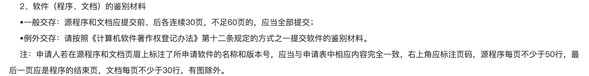

<h1 style="display: block; text-align: center; width:100%">Code2Word</h1>

## Description

把源代码导出为word，方便申请软件著作权申请。

## ToDoList


- [x] 忽略文件夹
- [x] 少于60页全部导出，多余60页导出前后30页
- [x] 每页不低于50行
- [x] 指定开始文件，放在word最前方
- [ ] 页眉
- [ ] 页码


## Start
### 方法1: 直接clone项目导出
#### 1.克隆项目并安装
```
git clone https://github.com/chenxu2656/code2word.git

yarn 
or
npm i
```
#### 2.修改export.js参数

- `dirPath`: `String`,导出的文件夹路径，绝对｜相对 路径
- `ignoreFolder`: `[Array]`,忽略的文件夹名
- `filename`: `String`, 导出文件名，不需要加后缀
- `startFile`: `String`,指定开始文件，放在word最前方
```
import exportDoc from './index.js'
// 相对路径
const dirPath = './'
// 绝对路径
// const dirPath = '/Users/chenxu/Desktop/myPro/code2word'
const ignoreFolder = ['assets','dataSource']
const filename = 'code2word'
const startFile = 'index.js'
exportDoc(dirPath,startFile,ignoreFolder,filename)
```

#### 3. 导出文件

`npm run export`

## DEMO

<video width="500" controls>
<source src="http://qiniu-btfblog-bucket.xccit.cn/code2word.mp4" type="video/mp4">您的浏览器不支持 HTML5 video 标签。
</video>s